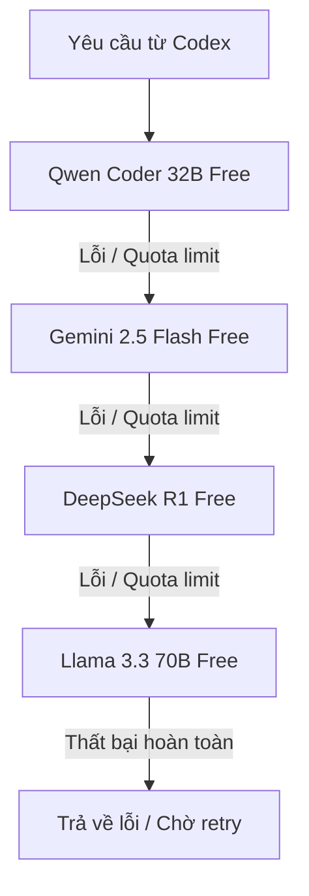

# 🎛️ Configuration Profiles & Models

Tài liệu chi tiết về các Profile cấu hình có sẵn trong **Codex CLI Ultimate** và nguyên lý hoạt động của hệ thống mô hình.

---

## 🗺️ Cấu trúc các Profile (Profile Mappings)

### 1. Free Profile (`config/free.toml`)
Sử dụng các mô hình miễn phí thông qua cổng OpenRouter. Phù hợp cho lập trình viên muốn tối ưu hóa chi phí (0đ).
- **Mô hình Coding chính**: `qwen/qwen-2.5-coder-32b-instruct:free` (Model code mã nguồn mở tốt nhất hiện tại).
- **Mô hình Logic/Reasoning**: `deepseek/deepseek-r1:free` (Mô hình suy luận chiều sâu).
- **Mô hình Fast/Context**: `google/gemini-2.5-flash:free` (Model phản hồi nhanh, context lớn).

---

### 2. Premium Profile (`config/premium.toml`)
Sử dụng các mô hình thương mại cao cấp nhất thế giới qua API key cá nhân của bạn.
- **Claude 3.5 Sonnet**: Lựa chọn tối ưu nhất cho lập trình và phân tích cấu trúc phức tạp.
- **GPT-4o / GPT-4o mini**: Tốc độ phản hồi cực nhanh, độ ổn định cao.
- **Gemini 1.5 Pro**: Tối ưu cho xử lý các file codebase siêu lớn (Long Context).

---

### 3. Local Profile (`config/local.toml`)
Chạy hoàn toàn ngoại tuyến (Offline) bằng việc kết nối tới Ollama / LM Studio nội bộ.
- Bảo mật thông tin mã nguồn 100%.
- Không phụ thuộc vào đường truyền Internet.
- **Mô hình khuyên dùng**: `qwen2.5-coder:7b` hoặc `deepseek-r1:8b`.

---

## 🔄 Chuỗi chuyển hướng tự động (Auto Fallback Chain)

Khi sử dụng OpenRouter Free, các giới hạn lượt gọi (Rate limits) rất dễ bị chạm. Cấu hình `free.toml` đã được tích hợp tính năng **Auto Fallback** trong query parameters:



Để thay đổi chuỗi fallback này, hãy sửa danh sách `models` trong file profile tương ứng ở mục:
```toml
[model_providers.openrouter.query_params]
models = [ "model_1", "model_2", "model_3" ]
route = "fallback"
```
