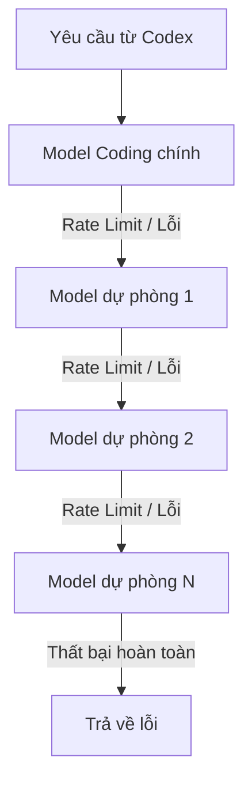

# 🎛️ Configuration Profiles & Models

Tài liệu chi tiết về các Profile cấu hình có sẵn trong **Codex CLI Ultimate** và nguyên lý hoạt động của hệ thống mô hình.

---

## 🗺️ Cấu trúc các Profile (Profile Mappings)

### 1. Free Profile (`config/free.toml`)
Sử dụng các mô hình miễn phí thông qua cổng OpenRouter với cơ chế **Auto Fallback**. Phù hợp cho lập trình viên muốn tối ưu hóa chi phí (0đ).
- **Danh sách model được cập nhật tự động** thông qua `codex config update-free`.
- Tận dụng cơ chế **Fallback Routing** của OpenRouter: khi model chính bị rate-limit, tự động chuyển sang model tiếp theo trong danh sách mà không cần retry phía client.

---

### 2. Premium Profile (`config/premium.toml`)
Sử dụng các mô hình thương mại cao cấp nhất thế giới qua API key cá nhân của bạn.
- **Claude Sonnet 4 / Opus 4.8**: Lựa chọn tối ưu nhất cho lập trình và phân tích cấu trúc phức tạp.
- **GPT-4o / GPT-4o mini**: Tốc độ phản hồi cực nhanh, độ ổn định cao.
- **Gemini 2.5 Pro**: Tối ưu cho xử lý các file codebase siêu lớn (Long Context).

---

### 3. Local Profile (`config/local.toml`)
Chạy hoàn toàn ngoại tuyến (Offline) bằng việc kết nối tới Ollama / LM Studio nội bộ.
- Bảo mật thông tin mã nguồn 100%.
- Không phụ thuộc vào đường truyền Internet.
- **Mô hình khuyên dùng**: `qwen2.5-coder:7b` hoặc `deepseek-r1:8b`.

---

### 4. Ollama Profile (`config/ollama.toml`)
Cấu hình chuyên biệt dành riêng cho Ollama với tuỳ chỉnh base URL.
- Kết nối tới `http://localhost:11434/v1`
- Không cần API key (set `env_key` thành bất kỳ giá trị nào)
- Sử dụng bất kỳ model nào bạn đã pull về máy

---

### 5. OpenRouter Profile (`config/openrouter.toml`)
Cấu hình OpenRouter độc lập với chuỗi fallback model.
- Danh sách model fallback được đồng bộ từ OpenRouter API.
- Sử dụng `route = "fallback"` để tự động retry khi gặp rate limit.
- Đọc API key từ biến môi trường `OPENROUTER_API_KEY`.

---

## 🔄 Chuỗi chuyển hướng tự động (Auto Fallback Chain)

Khi sử dụng OpenRouter Free, các giới hạn lượt gọi (Rate limits) rất dễ bị chạm. File `free.toml` và `openrouter.toml` được tích hợp cơ chế **Auto Fallback** thông qua query parameters:



### Cấu hình query_params

> **Lưu ý**: Codex CLI yêu cầu `query_params` là `map<string, string>`, vì vậy `models` phải là một chuỗi phân cách bằng dấu phẩy, **không phải** mảng (array).

```toml
[model_providers.openrouter.query_params]
models = "cohere/north-mini-code:free,nvidia/nemotron-3-nano-omni-30b-a3b-reasoning:free,nvidia/nemotron-3-ultra-550b-a55b:free"
route = "fallback"
```

> **Cơ chế hoạt động**: OpenRouter nhận danh sách `models` và thử lần lượt từ model đầu tiên đến cuối cùng. Nếu model đầu trả về rate-limit hoặc lỗi, OpenRouter tự động chuyển sang model tiếp theo mà client không cần làm gì.

---

## 🔄 Cập nhật danh sách model tự động

Danh sách model free trên OpenRouter thay đổi thường xuyên (model mới xuất hiện, model cũ ngừng hỗ trợ free). Dự án cung cấp script tự động đồng bộ:

### CLI: `codex config update-free`

```powershell
codex config update-free
```

Script này sẽ:
1. Gọi `https://openrouter.ai/api/v1/models` để lấy danh sách model mới nhất.
2. Lọc các model free (`:free` suffix hoặc `pricing = 0`).
3. Phân loại ưu tiên:
   - **Tier 1 (Coding)**: Model chuyên code (có chứa `coder`, `code`, `qwen`, ...) được ưu tiên làm model chính.
   - **Tier 2 (Reasoning)**: Model suy luận với context >= 32K tokens.
   - **Tier 3 (General)**: Các model còn lại, sắp xếp theo context length.
4. Inject `[model_providers.openrouter.query_params]` vào profile TOML.
5. Tạo backup file `.bak` trước khi ghi.

### Tích hợp trong `codex update`

Khi chạy `codex update`, script cũng tự động gọi `generate-free-profile.ps1` để làm mới danh sách model free.

### Offline fallback

Nếu API OpenRouter không truy cập được (mất mạng, API key không hợp lệ), script sử dụng danh sách cứng (hardcoded fallback) được cập nhật trong repo:

```
qwen/qwen-2.5-coder-32b-instruct:free
deepseek/deepseek-r1:free
google/gemini-2.5-flash:free
meta-llama/llama-3.3-70b-instruct:free
nvidia/nemotron-3-ultra-550b-a55b:free
```

### Tuỳ chỉnh số lượng model

Bạn có thể truyền tham số trực tiếp đến script:

```powershell
# Chỉ lấy 5 model
codex config update-free -MaxModels 5

# Chỉ lấy model có context >= 16K
codex config update-free -MinContext 16000

# Xem trước thay đổi mà không ghi file
& .\scripts\generate-free-profile.ps1 -DryRun
```
