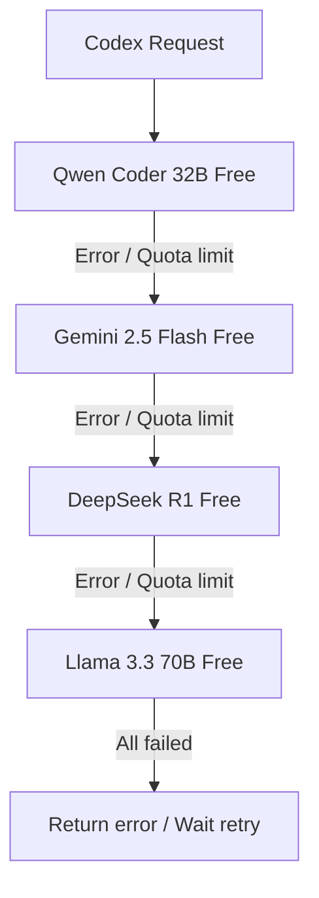

# 🎛️ Configuration Profiles & Models

Detailed documentation about available profiles in **Codex CLI Ultimate** and how the model system works.

---

## 🗺️ Profile Mappings

### 1. Free Profile (`config/free.toml`)
Uses free models through the OpenRouter gateway. Ideal for developers who want zero-cost AI assistance.
- **Primary Coding Model**: `qwen/qwen-2.5-coder-32b-instruct:free` (Best open-source coding model currently available)
- **Reasoning Model**: `deepseek/deepseek-r1:free` (Deep reasoning for complex problem solving)
- **Fast/Context Model**: `google/gemini-2.5-flash:free` (Fast responses, large context window)

---

### 2. Premium Profile (`config/premium.toml`)
Uses top-tier commercial models via your personal API keys.
- **Claude Sonnet 4 / Opus 4.8**: Best for programming and complex structural analysis
- **GPT-4o / GPT-4o mini**: Fast response times, high reliability
- **Gemini 2.5 Pro**: Optimized for very large codebase context handling

---

### 3. Local Profile (`config/local.toml`)
Fully offline — connects to local Ollama / LM Studio.
- 100% source code privacy
- No internet dependency
- **Recommended Models**: `qwen2.5-coder:7b` or `deepseek-r1:8b`

---

### 4. Ollama Profile (`config/ollama.toml`)
Dedicated profile for Ollama-specific configuration with custom base URL.
- Connects to `http://localhost:11434/v1`
- No API key required (set `env_key` to any placeholder value)
- Use any model you've pulled locally

---

### 5. OpenRouter Profile (`config/openrouter.toml`)
Standalone OpenRouter profile with fallback model chain.
- Customizable model fallback list
- Uses `route = "fallback"` for automatic retry on rate limits
- Reads API key from `OPENROUTER_API_KEY` env var

---

## 🔄 Auto Fallback Chain

When using OpenRouter Free, rate limits are common. The `free.toml` profile includes built-in **Auto Fallback** via query parameters:



To customize the fallback chain, edit the `models` list in your profile:
```toml
[model_providers.openrouter.query_params]
models = [ "model_1", "model_2", "model_3" ]
route = "fallback"
```
