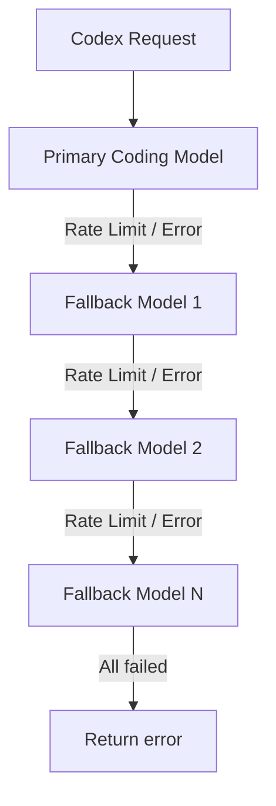

# 🎛️ Configuration Profiles & Models

Detailed documentation about available profiles in **Codex CLI Ultimate** and how the model system works.

---

## 🗺️ Profile Mappings

### 1. Free Profile (`config/free.toml`)
Uses free models through the OpenRouter gateway with **Auto Fallback** support. Ideal for developers who want zero-cost AI assistance.
- **Model list updated automatically** via `codex config update-free`.
- Leverages OpenRouter's **Fallback Routing**: when the primary model hits a rate limit, it automatically falls through to the next model in the list — no client-side retry needed.

---

### 2. Premium Profile (`config/premium.toml`)
Uses top-tier commercial models via your personal API keys.
- **Claude Sonnet 4 / Opus 4.8**: Best for programming and complex structural analysis
- **GPT-4o / GPT-4o mini**: Fast response times, high reliability
- **Gemini 2.5 Pro**: Optimized for very large codebase context handling

---

### 3. Local Profile (`config/local.toml`)
Fully offline — connects to local Ollama / LM Studio.
- 100% source code privacy
- No internet dependency
- **Recommended Models**: `qwen2.5-coder:7b` or `deepseek-r1:8b`

---

### 4. Ollama Profile (`config/ollama.toml`)
Dedicated profile for Ollama-specific configuration with custom base URL.
- Connects to `http://localhost:11434/v1`
- No API key required (set `env_key` to any placeholder value)
- Use any model you've pulled locally

---

### 5. OpenRouter Profile (`config/openrouter.toml`)
Standalone OpenRouter profile with fallback model chain.
- Fallback model list synced from OpenRouter API.
- Uses `route = "fallback"` for automatic retry on rate limits.
- Reads API key from `OPENROUTER_API_KEY` env var.

---

## 🔄 Auto Fallback Chain

When using OpenRouter Free, rate limits are common. The `free.toml` and `openrouter.toml` profiles include built-in **Auto Fallback** via query parameters:



### query_params Configuration

```toml
[model_providers.openrouter.query_params]
models = [
  "cohere/north-mini-code:free",          # Coding model (highest priority)
  "nvidia/nemotron-3-nano-omni-30b-a3b-reasoning:free",  # Reasoning model
  "nvidia/nemotron-3-ultra-550b-a55b:free",
  # ... more models
]
route = "fallback"
```

> **How it works**: OpenRouter receives the `models` list and tries each one in order. If the first model returns a rate-limit or error, OpenRouter automatically switches to the next — no client intervention needed.

---

## 🔄 Auto-Refreshing the Model List

Free models on OpenRouter change frequently (new models appear, old ones drop free support). The project provides an auto-sync mechanism:

### CLI: `codex config update-free`

```powershell
codex config update-free
```

This script will:
1. Call `https://openrouter.ai/api/v1/models` to fetch the latest model catalog.
2. Filter free models (`:free` suffix or `pricing = 0`).
3. Prioritize by category:
   - **Tier 1 (Coding)**: Code-specialized models (containing `coder`, `code`, `qwen`, ...) get top priority.
   - **Tier 2 (Reasoning)**: Reasoning models with context >= 32K tokens.
   - **Tier 3 (General)**: All remaining models, sorted by context length.
4. Inject `[model_providers.openrouter.query_params]` into the target profile.
5. Create a `.bak` backup before writing.

### Integrated with `codex update`

Running `codex update` automatically calls `generate-free-profile.ps1` to refresh the free model list after pulling the latest repository changes.

### Offline fallback

If the OpenRouter API is unreachable (no network, invalid API key), the script uses a built-in hardcoded list shipped with the repository:

```
qwen/qwen-2.5-coder-32b-instruct:free
deepseek/deepseek-r1:free
google/gemini-2.5-flash:free
meta-llama/llama-3.3-70b-instruct:free
nvidia/nemotron-3-ultra-550b-a55b:free
```

### Customizing the model count

You can pass parameters directly to the generation script:

```powershell
# Only 5 models
codex config update-free -MaxModels 5

# Only models with context >= 16K
codex config update-free -MinContext 16000

# Preview changes without writing
& .\scripts\generate-free-profile.ps1 -DryRun
```
